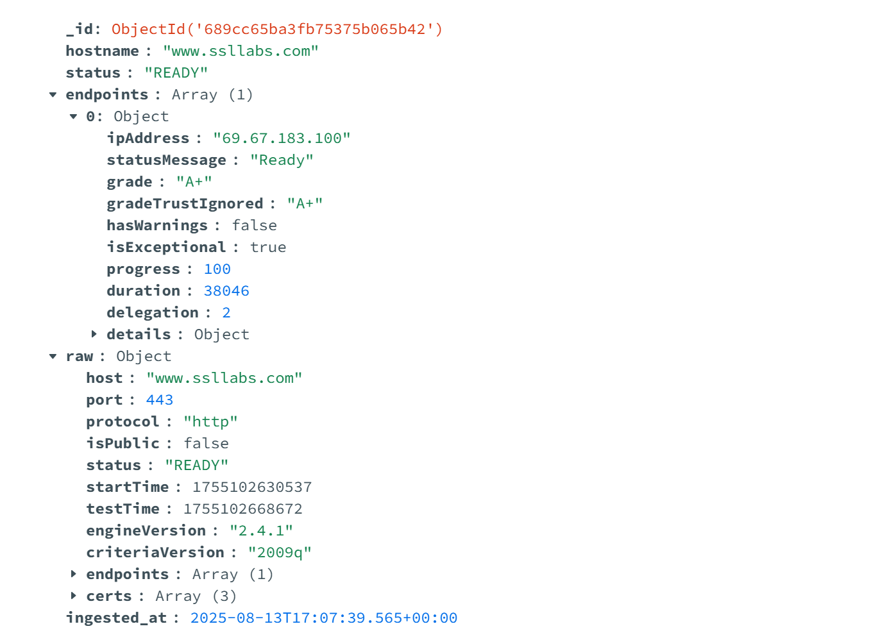
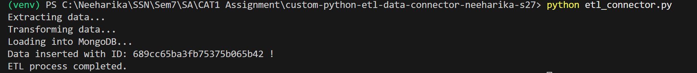

# SSL Labs ETL Connector

#### Author : S Neeharika (3122 22 5001 079)

<hr>

## 📝 Project Overview

This project connects to the [SSL Labs API](https://api.ssllabs.com/api/v3/) to:

1. Retrieve SSL/TLS configuration analysis for a given domain.
2. Handle iterative polling until results are ready (or use cached results for speed).
3. Store the analysis results in a MongoDB database.


---

## 🌐 API Endpoint Used

### **Analyze API**

Retrieves SSL/TLS configuration analysis for a given hostname.

**Endpoint:**

GET [https://api.ssllabs.com/api/v3/analyze]()

**Common Parameters:**
- `host` – The domain name to analyze (e.g., `www.ssllabs.com`).
- `fromCache` – If `on`, use cached results when available.
- `all` – If `done`, return full results in one call.
- `maxAge` – Maximum age (in hours) for cached results.

---

## ⚙️ Setup and Installation

<h5>1. Clone the repository</h5>

```bash
git clone https://github.com/Kyureeus-Edtech/custom-python-etl-data-connector-neeharika-s27/
```

<h5>2. Create a Virtual Environment</h5>

```bash
python -m venv venv
```

<h5>3. Activate the Virtual Environment</h5?>

<h6>Windows</h6>

```bash
venv\Scripts\activate
```

<h5>4. Install dependencies</h5>

```bash
pip install -r requirements.txt 
```

<h5>5. Create .env file</h5>

```bash
MONGODB_URI=mongodb://localhost:27017
MONGODB_DB=ssn_etl
MONGODB_COLLECTION=ssllabs_analyze_raw
```
<hr>

## 🚀 Usage

<h5>Run the ETL pipeline</h5>

```bash
python etl_connector.py
```

<h4>Sample Data Inserted in MongoDB</h4>



<h4>Progress Tracked in Terminal</h4>



<hr>

### 🛡️ Error Handling Mechanisms

<hr>

##### 1. Checking Rate Limit

```bash
if isinstance(data, dict) and "errors" in data:
    for err in data["errors"]:
        if "Rate limit" in err.get("message", ""):
            print("Rate limit reached, retrying...")
            time.sleep(RETRY_DELAY)
            attempt += 1
            continue
```

##### 2. Validate Basic API Response Structure

```bash
if not isinstance(data, dict) or "host" not in data:
    print("Invalid API response structure.")
    return None
```

##### 3. Empty Payload Check

```bash
if not data.get("endpoints"):
    print("Empty payload returned by API.")
    return None
```

##### 4. Connectivity Error

```bash
try:
    response = requests.get(BASE_URL, params=params, timeout=30)
    response.raise_for_status()
    data = response.json()
    ...
    return data
except requests.RequestException as e:
    print(f"Connectivity error: {e}")
    time.sleep(RETRY_DELAY)
    attempt += 1
```
<hr>

## 🗂️ Project Structure

```bash
custom-python-etl-data-connector-neeharika-s27/
├── README.md                  # Project documentation
├── requirements.txt           # Python dependencies
├── .gitignore                 # Ignore .env, venv
├── etl_connector.py           # Entry point to run the ETL process
├── terminal_output.png        # Terminal output image screenshot      
└── mongodb_output.png         # MongoDB Output image screenshot
```

<hr>

## 📌 Summary 

The SSL Labs Analyze API was used to perform automated SSL/TLS assessments for a target domain. The process followed an ETL workflow — extracting raw JSON response data from the API, transforming it to highlight key security metrics such as supported protocols, and certificate details, and loading the structured results into a usable storage format. Secure coding practices, including .gitignore usage, were applied to avoid exposing sensitive files in the Git repository. This streamlined approach enables efficient, repeatable security analysis and reporting.

<hr>
